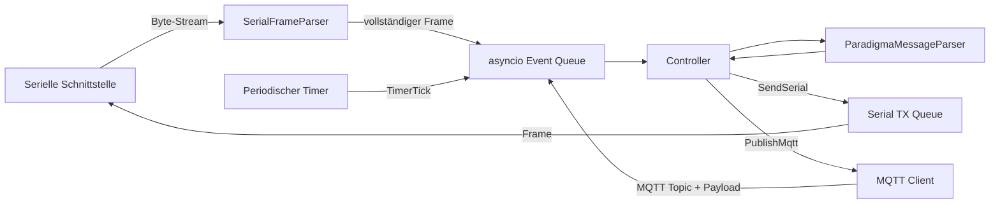
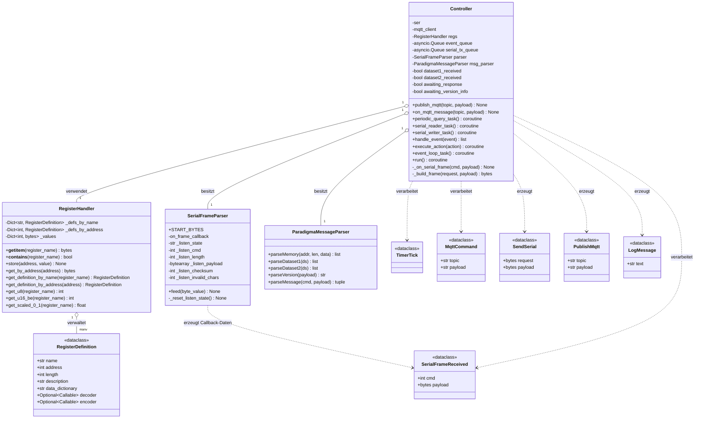
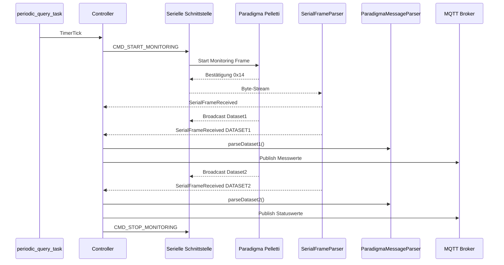

# Dokumentation: Paradigma Pelletti MQTT Bridge

## 1. Zweck des Programms

Das Python-Skript implementiert eine Kommunikationsbrücke zwischen einer **Paradigma Pelletti Heizungssteuerung**, einer seriellen Schnittstelle und einer MQTT-basierten Heimautomatisierung.

Die Software erfüllt drei zentrale Aufgaben:

1. **Serielle Kommunikation mit der Heizungssteuerung**  
   Das Skript sendet Kommandos an die Paradigma-Regelung und empfängt Antworten sowie Broadcast-Datensätze.

2. **Dekodierung von Mess- und Regelparametern**  
   Zwei zyklisch empfangene Datensätze werden interpretiert und in semantische Messwerte wie Temperaturen, Betriebsstunden, Betriebsart oder Störcodes übersetzt.

3. **MQTT-Anbindung an die Heimautomatisierung**  
   Ausgelesene Werte werden über MQTT veröffentlicht. Zusätzlich können MQTT-Kommandos empfangen werden, um Parameter der Heizung auszulesen oder zu schreiben.

---

## 2. Grobarchitektur

Das Programm ist ereignisgetrieben aufgebaut. Die Kommunikation mit der seriellen Schnittstelle, MQTT und der periodischen Abfrage wird über `asyncio` nebenläufig organisiert.



Die Architektur trennt bewusst zwischen:

- byteorientiertem Frame-Parsing,
- semantischer Interpretation der Paradigma-Nachrichten,
- Registerverwaltung,
- zentraler Steuerlogik,
- serieller Ausgabe,
- MQTT-Ausgabe.

---

## 3. Modulstruktur

Das Skript enthält folgende Hauptbereiche:

| Bereich | Aufgabe |
|---|---|
| Konstanten | Definition von Paradigma-Kommandos, Antwortcodes und internen Nachrichtentypen |
| Hilfsfunktionen | Umrechnung von Rohdaten in Temperaturen, Integerwerte, Betriebsarten, Störcodes und Datumswerte |
| Registermodell | Beschreibung und Speicherung von Heizungsregistern |
| Frame-Parser | Byteweises Zusammensetzen serieller Nachrichten |
| Message-Parser | Semantische Interpretation gültiger Frames |
| Event- und Action-Klassen | Entkopplung von Ereignissen und Seiteneffekten |
| Controller | Zentrale Ablaufsteuerung |
| `__main__` | Initialisierung von Serial, MQTT und Controller |

---

## 4. Kommunikationsmodell

### 4.1 Serielles Frame-Format

Die serielle Kommunikation verwendet Telegramme der Form:

```text
[CMD][LEN][PAYLOAD][CHECKSUM]
```

Die Checksumme ist so gewählt, dass die Summe aller Bytes modulo 256 null ergibt:

```text
(CMD + LEN + sum(PAYLOAD) + CHECKSUM) & 0xFF == 0
```

Beim Senden erzeugt der Controller Frames mit:

```python
checksum = (-(0x0a + sum(request) + length + sum(payload))) & 0xFF
```

### 4.2 Startbytes

Der `SerialFrameParser` akzeptiert folgende Startbytes:

| Startbyte | Bedeutung |
|---|---|
| `0x0A` | Bestätigungs-/Steuerantwort |
| `0xFC` | Broadcast-Datensatz |
| `0xFD` | Antwort auf Speicher- oder Versionsabfrage |

### 4.3 Paradigma-Kommandos

| Konstante | Bytefolge | Bedeutung |
|---|---:|---|
| `CMD_READ_MEMORY` | `1C 0C 03` | Speicher/Register lesen |
| `CMD_START_MONITORING` | `14` | Monitoring starten |
| `CMD_STOP_MONITORING` | `15` | Monitoring stoppen |
| `CMD_START_READ_VERSION` | `16` | Versionsausgabe starten |
| `CMD_STOP_READ_VERSION` | `17` | Versionsausgabe stoppen |
| `CMD_WRITE_MEMORY` | `1D 0C 11 53 45 54` | Speicher/Register schreiben |
| `CMD_WRITE_CLOCK` | `1D 0C 09 55 48 52` | Uhr schreiben |

---

## 5. UML-Klassendiagramm

Das folgende Diagramm zeigt die wichtigsten Klassen, Datenstrukturen und Abhängigkeiten.



---

## 6. Klassen und Datenstrukturen im Detail

## 6.1 `RegisterDefinition`

`RegisterDefinition` beschreibt ein einzelnes Register der Heizungssteuerung.

```python
@dataclass
class RegisterDefinition:
    name: str
    address: int
    length: int
    description: str
    data_dictionary: str
    decoder: Optional[Callable[[bytes], float]] = None
    encoder: Optional[Callable[float, [bytes]]] = None
```

### Bedeutung der Felder

| Feld | Bedeutung |
|---|---|
| `name` | Menschlich lesbarer Registername |
| `address` | Speicheradresse in der Heizungssteuerung |
| `length` | Länge des Registers in Bytes |
| `description` | Beschreibung des Parameters |
| `data_dictionary` | Zusatzinformation zur Interpretation |
| `decoder` | Funktion zur Umwandlung von Rohbytes in einen physikalischen oder logischen Wert |
| `encoder` | Funktion zur Rückwandlung eines Wertes in Rohbytes |

Beispiele für registrierte Parameter sind:

- Betriebsart Heizkreis 1
- Heiztemperatur
- Komforttemperatur
- Absenktemperatur
- Ferienbeginn
- Ferienende

---

## 6.2 `RegisterHandler`

Der `RegisterHandler` verwaltet Registerdefinitionen und optional gespeicherte Rohwerte.

### Interne Datenstrukturen

```python
self._defs_by_name: Dict[str, RegisterDefinition]
self._defs_by_address: Dict[int, RegisterDefinition]
self._values: Dict[int, bytes]
```

Damit sind zwei Zugriffspfade möglich:

- über den Registernamen,
- über die numerische Adresse.

### Typischer Zugriff

```python
regs.store(0x0005, b"\x01\x2c")
raw = regs["Heiztemperatur HK1"]
```

### Bewertung

Die Klasse bildet eine sinnvolle Abstraktionsschicht zwischen den binären Registerdaten der Heizungssteuerung und der semantischen Verarbeitung im restlichen Programm.

---

## 6.3 `SerialFrameParser`

Der `SerialFrameParser` ist ein byteorientierter Zustandsautomat. Er wird mit jedem neu empfangenen Byte aufgerufen.

```python
parser.feed(data[0])
```

### Zustände

| Zustand | Aufgabe |
|---|---|
| `WAIT_CMD` | Warten auf gültiges Startbyte |
| `WAIT_LEN` | Lesen der Payload-Länge |
| `WAIT_PAYLOAD` | Sammeln der Nutzdaten |
| `WAIT_CHECKSUM` | Prüfen der Checksumme |

### Ablauf

1. Ein Byte mit Wert `0x0A`, `0xFC` oder `0xFD` startet ein neues Frame.
2. Das nächste Byte gibt die Nutzdatenlänge an.
3. Die Payload wird vollständig gesammelt.
4. Das letzte Byte wird als Checksumme geprüft.
5. Bei gültiger Checksumme wird `on_frame_callback(cmd, payload)` aufgerufen.

Der Parser ist robust gegenüber ungültigen Bytes vor einem Frame und zählt diese über `_listen_invalid_chars`.

---

## 6.4 Event-Klassen

Die Event-Klassen beschreiben Ereignisse, die in der zentralen Ereigniswarteschlange verarbeitet werden.

### `TimerTick`

Wird periodisch erzeugt und löst eine zyklische Abfrage der Heizungsdaten aus.

### `MqttCommand`

Repräsentiert ein von MQTT empfangenes Kommando.

```python
@dataclass
class MqttCommand:
    topic: str
    payload: str
```

### `SerialFrameReceived`

Repräsentiert ein vollständig empfangenes und checksum-geprüftes serielles Frame.

```python
@dataclass
class SerialFrameReceived:
    cmd: int
    payload: bytes
```

---

## 6.5 Action-Klassen

Actions beschreiben auszuführende Seiteneffekte. Der Controller erzeugt diese Actions aus Events.

### `SendSerial`

Beschreibt ein zu sendendes serielles Kommando.

### `PublishMqtt`

Beschreibt eine MQTT-Veröffentlichung.

### `LogMessage`

Beschreibt eine auszugebende Log-/Statusmeldung.

Diese Trennung von **Event-Verarbeitung** und **Action-Ausführung** erleichtert Tests und verbessert die Lesbarkeit der Steuerlogik.

---

## 6.6 `ParadigmaMessageParser`

Der `ParadigmaMessageParser` interpretiert gültige Frames semantisch.

### `parseMessage(cmd, payload)`

Diese Methode klassifiziert Frames in interne Nachrichtentypen:

| Rückgabewert | Bedeutung |
|---|---|
| `CONFIRM_START_MONITORING` | Start Monitoring wurde bestätigt |
| `CONFIRM_STOP_MONITORING` | Stop Monitoring wurde bestätigt |
| `CONFIRM_WRITE_MEMORY` | Schreibzugriff wurde bestätigt |
| `DATASET1` | Broadcast-Datensatz 1 empfangen |
| `DATASET2` | Broadcast-Datensatz 2 empfangen |
| `MEMORY` | Antwort auf Register-/Speicherabfrage |
| `VERSION_INFO` | Versionsinformation empfangen |

### `parseDataset1(ds)`

Dekodiert Messwerte aus dem ersten Broadcast-Datensatz, unter anderem:

- Außentemperatur
- Warmwassertemperatur
- Kesselvorlauf
- Kesselrücklauf
- Raumtemperatur
- Heizkreis-Vorlauftemperatur
- Heizkreis-Rücklauftemperatur
- Pufferspeicher oben/unten
- Zirkulationstemperatur

Die Ergebnisse werden als Liste von `(topic, value)`-Tupeln zurückgegeben.

### `parseDataset2(ds)`

Dekodiert Status- und Regelwerte aus dem zweiten Broadcast-Datensatz, unter anderem:

- Raumsolltemperatur
- Vorlaufsolltemperatur
- Warmwasser-Solltemperatur
- Puffersolltemperatur
- Kesselbetriebsstunden
- Kesselstarts
- Störcode
- Betriebsart
- Heizkreisniveau
- Heizkreisleistung

### `parseMemory(addr, len, data)`

Interpretiert eine Speicherantwort anhand der Registerdefinitionen. Für jedes Register wird, sofern vorhanden, ein Decoder verwendet.

---

## 6.7 `Controller`

Der `Controller` ist die zentrale Steuerklasse des Programms.

### Hauptaufgaben

- Empfangen von Events
- Zustandsverwaltung der Kommunikation
- Starten und Stoppen des Monitorings
- Auslösen periodischer Abfragen
- Auswerten serieller Frames
- Veröffentlichen von MQTT-Werten
- Entgegennehmen von MQTT-Kommandos
- Serialisieren ausgehender Telegramme

### Wichtige Zustandsvariablen

| Variable | Bedeutung |
|---|---|
| `dataset1_received` | Datensatz 1 wurde während einer Monitoring-Phase empfangen |
| `dataset2_received` | Datensatz 2 wurde während einer Monitoring-Phase empfangen |
| `awaiting_response` | Controller wartet auf Monitoring-Daten |
| `awaiting_version_info` | Controller wartet auf Versionsinformationen |
| `running` | Hauptsteuerflag für Tasks |

### Nebenläufige Tasks

Der Controller startet vier `asyncio`-Tasks:

| Task | Funktion |
|---|---|
| `periodic_query_task()` | Erzeugt periodisch `TimerTick`-Events |
| `serial_reader_task()` | Liest Bytes von der seriellen Schnittstelle und speist den Frame-Parser |
| `serial_writer_task()` | Sendet Frames aus der Serial-TX-Queue |
| `event_loop_task()` | Zentrale Verarbeitung aller Events |

---

## 7. Ereignisverarbeitung im Controller

Die zentrale Methode ist:

```python
handle_event(self, event) -> list[Any]
```

Sie wandelt ein eingehendes Event in eine Liste von Actions um.

### 7.1 `TimerTick`

Bei einem Timer-Event wird das Monitoring gestartet:

```python
SendSerial(request=CMD_START_MONITORING, payload=[])
```

Danach erwartet der Controller Dataset1 und Dataset2.

### 7.2 `MqttCommand`

Unterstützte MQTT-Kommandos:

| Topic | Funktion |
|---|---|
| `paradigma/heating/setmode` | Betriebsart schreiben |
| `paradigma/heating/gettemperatures` | Temperaturregister lesen |
| `paradigma/heating/getferien` | Ferienprogrammregister lesen |
| `paradigma/heating/settemperatures` | vorgesehen, aber noch nicht implementiert |

### 7.3 `SerialFrameReceived`

Serielle Frames werden zunächst durch `ParadigmaMessageParser.parseMessage()` klassifiziert.

Danach reagiert der Controller abhängig vom Typ:

- Bestätigungen werden protokolliert.
- Versionsinformationen werden ausgewertet und anschließend gestoppt.
- Dataset1 und Dataset2 werden dekodiert und per MQTT publiziert.
- Nach Empfang beider Datensätze wird das Monitoring wieder gestoppt.
- Speicherantworten werden über Registerdefinitionen interpretiert und ebenfalls per MQTT ausgegeben.

---

## 8. Datenfluss: Periodische Messwertabfrage



---

## 9. MQTT-Datenmodell

### 9.1 Veröffentlichte Topics

Die Messwerte aus den Broadcast-Datensätzen werden unterhalb von:

```text
homie/Paradigma/
```

veröffentlicht.

Beispiele:

```text
homie/Paradigma/Fuehler/Aussentemperatur
homie/Paradigma/Warmwasser/Temperatur
homie/Paradigma/Kessel/Vorlauf
homie/Paradigma/Kessel/Betriebsstunden
homie/Paradigma/Heizkreis/Betriebsart
```

### 9.2 Empfangene Steuer-Topics

Das Skript subscribiert auf:

```text
paradigma/heating/#
```

Damit können Kommandos aus der Heimautomatisierung empfangen werden.

Beispiele:

```text
paradigma/heating/setmode
paradigma/heating/gettemperatures
paradigma/heating/getferien
```

---

## 10. Initialisierung im Hauptprogramm

Im `__main__`-Block werden folgende Komponenten erzeugt:

1. `RegisterHandler`
2. serielle Schnittstelle `/dev/ttyUSB0`
3. MQTT Client
4. MQTT Callback-Funktionen
5. MQTT Subscription
6. `Controller`
7. `asyncio` Event Loop

Vereinfacht:

```python
regs = RegisterHandler(REGISTER_DEFINITIONS)
ser = serial.Serial("/dev/ttyUSB0", timeout=0)
client = mqtt.Client(mqtt.CallbackAPIVersion.VERSION2)
controller = Controller(ser, client, regs)
asyncio.run(controller.run())
```

---

## 11. Erweiterungspunkte

## 11.1 Neue Register hinzufügen

Neue Register können über weitere `RegisterDefinition`-Einträge ergänzt werden.

Beispiel:

```python
RegisterDefinition(
    name="Neue Temperatur",
    address=0x0010,
    length=2,
    description="Neue Temperaturbeschreibung",
    data_dictionary="In 0.1 K",
    decoder=decode_temperature,
    encoder=encode_temperature,
)
```

## 11.2 Neue MQTT-Kommandos

Neue MQTT-Kommandos werden in `Controller.handle_event()` im Zweig `MqttCommand` ergänzt.

## 11.3 Neue Datensatzfelder

Zusätzliche Felder aus Dataset1 oder Dataset2 können in `parseDataset1()` beziehungsweise `parseDataset2()` ergänzt werden.

## 11.4 Konfigurationsdateien

Aktuell sind viele Parameter fest im Skript hinterlegt, zum Beispiel:

- serielle Schnittstelle,
- MQTT-Broker,
- Registerdefinitionen,
- Topic-Struktur.

Eine sinnvolle Weiterentwicklung wäre die Auslagerung in JSON-, YAML- oder TOML-Dateien.

---

## 12. Hinweise zu aktuellen Implementierungsdetails

Beim Lesen des Codes fallen einige Punkte auf, die für eine spätere Stabilisierung relevant sind:

1. In `ParadigmaMessageParser` ist der Konstruktor als `__init` statt `__init__` geschrieben. Dadurch wird er nicht automatisch als Python-Konstruktor aufgerufen.

2. In `parseMemory()` wird `regs.get_definition_by_address(addr)` verwendet, obwohl `regs` dort nicht als Instanzvariable referenziert wird. Wahrscheinlich sollte hier `self.regs` verwendet werden.

3. In `RegisterHandler.get_scaled_0_1()` wird `self.get_16_be()` aufgerufen. Eine Methode dieses Namens existiert nicht; vermutlich ist `get_u16_be()` gemeint.

4. Einige Payloads werden als `[]` übergeben, obwohl die Typdefinition `bytes` nahelegt. Da `_build_frame()` später `bytes(payload)` aufruft, funktioniert dies praktisch, ist aber semantisch uneinheitlich.

5. Das Logging ist gemischt implementiert: teilweise über `log.debug()`, teilweise über `print()`.

6. Die MQTT-Payload aus `_onMessage()` ist ein Byteobjekt. In `MqttCommand` ist `payload` jedoch als `str` typisiert. Bei Topics wie `setmode` muss gegebenenfalls explizit dekodiert werden:

```python
payload = message.payload.decode("utf-8")
```

---

## 13. Zusammenfassung

Das Skript ist als asynchrone Kommunikationsbrücke zwischen Paradigma Pelletti Heizungsregelung und MQTT-Heimautomatisierung konzipiert. Die wesentliche Stärke der Architektur liegt in der Trennung von:

- serieller Frame-Rekonstruktion,
- semantischer Nachrichteninterpretation,
- ereignisbasierter Steuerlogik,
- MQTT-Publishing,
- Registermodellierung.

Damit eignet sich der Code gut als Grundlage für eine robuste Heizungsintegration in Home Assistant, openHAB oder andere MQTT-fähige Automatisierungssysteme.

